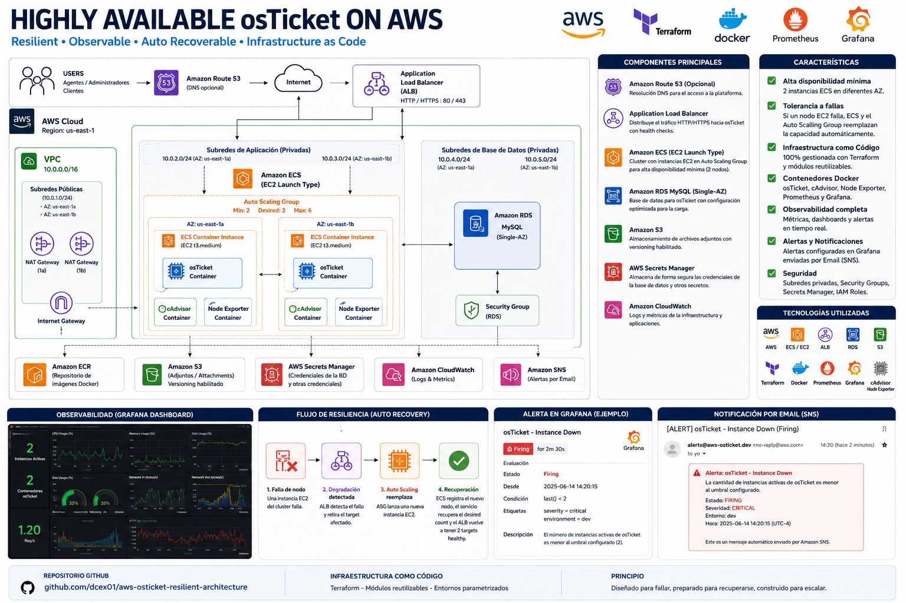

# Highly Available osTicket on AWS



Production-style proof of concept for deploying a resilient and observable osTicket platform on AWS using Infrastructure as Code, container orchestration, automated recovery and proactive monitoring.

## Project Overview

The goal of this project was not only to deploy osTicket on AWS, but to validate how the platform behaves when infrastructure components fail.

The solution was designed around:

- High availability
- Infrastructure as Code
- Automated recovery
- Observability
- Secure secrets management
- Controlled resilience testing

## Architecture

The platform includes:

- Amazon VPC with segmented public, application and database subnets
- Amazon ECS using the EC2 launch type
- Auto Scaling Group with multiple ECS container instances
- Application Load Balancer
- Amazon RDS MySQL
- Amazon ECR
- Amazon S3
- AWS Secrets Manager
- AWS Systems Manager Session Manager
- Prometheus
- cAdvisor
- Node Exporter
- Grafana
- Amazon SNS
- Terraform

## Infrastructure as Code

The complete environment is managed with Terraform and organized using reusable modules.

```text
.
├── docker/
│   ├── osticket/
│   └── prometheus/
├── environments/
│   └── dev/
├── modules/
│   ├── alb/
│   ├── ecr/
│   ├── ecs/
│   ├── ecs_service/
│   ├── monitoring/
│   ├── networking/
│   ├── rds/
│   ├── s3/
│   └── secrets/
├── docs/
│   └── architecture.png
├── .gitignore
└── README.md